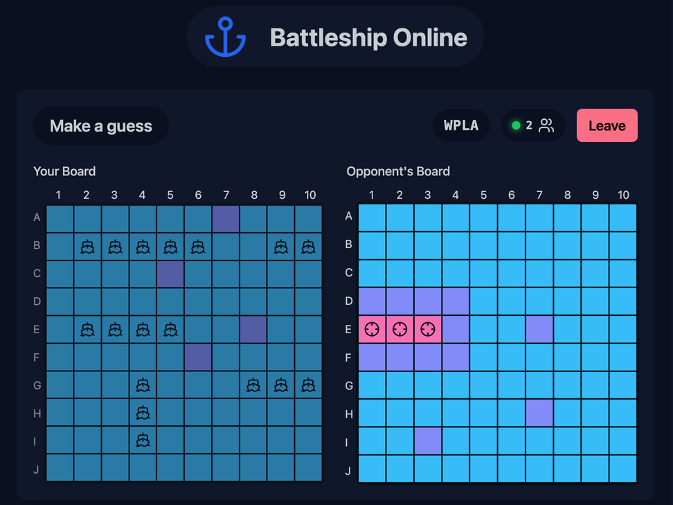
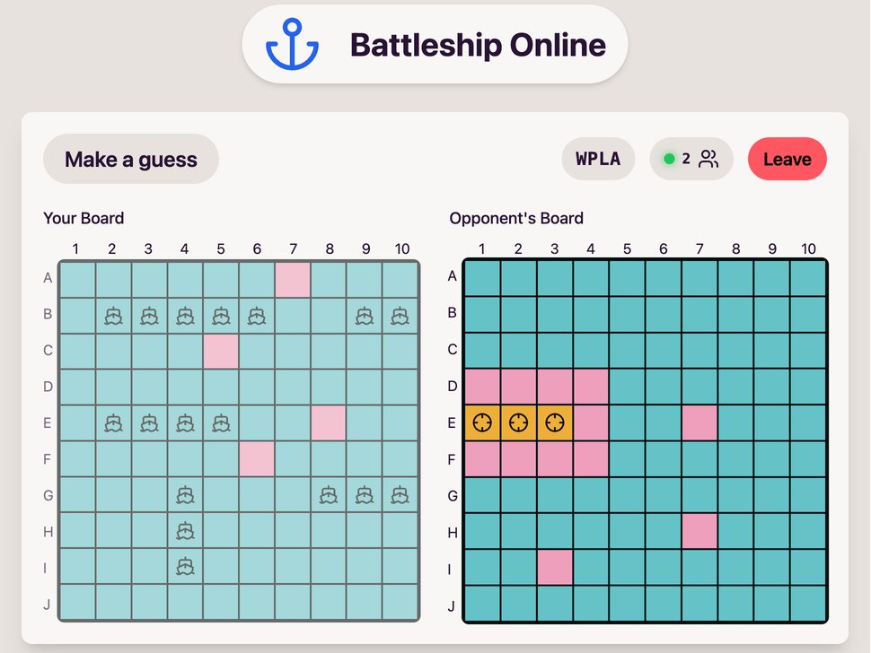

# Battleship Online

Play the classic game of Battleship against your friends online! Each player will take turns guessing the location of the other player's ships. The first player to sink all of the other player's ships wins!

Dark mode             |  Light mode
:-------------------------:|:-------------------------:
  |  

## Development Guide

The client is built using SvelteKit (static site) and the server uses Axum framework (Rust). The client and server communicate using Socket.io (WebSockets). PostgreSQL is used as a database to store the game state.

The client can be started using `npm run dev` inside `app` directory.

The server and the database services are containarized. Just run `docker compose up` to start the server and database services if you are working on the frontend.

If you are working on the server, you can run `cargo watch -i app -x run` to automatically restart the server when the source code changes, and `docker compose up -d db` to start the database service in the background.

SQLx is used as the database driver for Rust. The driver automatically tests the SQL query macros at compile time. This can fail the rust-analyzer or `cargo build` if the database isn't setup/running. You can run `docker compose up db` to start the database service. To disable this check altogether, set the `SQLX_OFFLINE` environment variable to `true`. 
